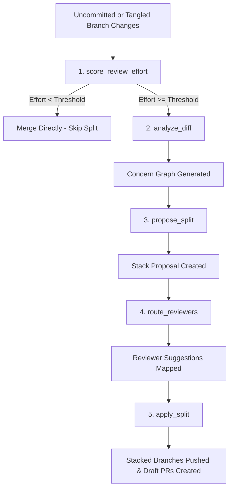

# untangle

> MCP-native PR decomposer for AI-generated diffs. Splits tangled commits into reviewable stacked PRs.

**Status:** 100% Complete — Implementation built and fully verified with test suite.

## Why

Median PR review time is up 441% in 2026 because AI coding agents produce diffs faster than humans can review them. Existing splitters (`pr-splitter`, Graphite, gh-stack) require humans to drive the split. `untangle` runs *inside the agent loop* via MCP, decomposing tangled diffs into a stacked PR series automatically — but only when decomposition is actually worth doing.

## What it does

Six core MCP tools and one unified orchestrator tool that decompose, score, route, and apply PR splits:

| Tool | Name | Description |
|---|---|---|
| `score_review_effort` | Circuit Breaker | Predicts review effort from static signals and decides if decomposition is needed. |
| `analyze_diff` | Diff Parser | Parses a unified diff into a ConcernGraph (DAG of semantic concerns). |
| `propose_split` | Split Planner | Plans a dependency-aware stack of slices from a ConcernGraph. |
| `apply_split` | Code Materializer | Commits, branches, and pushes stacked slices, creating draft PRs. |
| `summarize_slice` | PR Describer | Generates reviewer-ready PR titles and bodies for each slice. |
| `route_reviewers` | Review Router | Maps stacked slices to suggested reviewers using git blame and `CODEOWNERS`. |
| `decompose` | Unified Orchestrator | Executes all of the above tools end-to-end dynamically. |

See [`specs/`](./specs/) for the contract.

---

## Install & Setup

### 1. Build from Source
To install dependencies and compile the TypeScript source files to JavaScript:
```bash
npm install
npm run build
```

### 2. Verify with Test Suite
To verify the build against the unit and acceptance test suites:
```bash
npm run test
```

---

## Register MCP Server

Add the compiled server to your AI client's configuration. Here are configurations for popular tools:

### Cursor / VS Code (Cody / Antigravity)
Add this to your `mcp_config.json` (located under `~/.gemini/antigravity/mcp_config.json` or custom configuration directories):
```json
{
  "mcpServers": {
    "untangle": {
      "command": "node",
      "args": ["/absolute/path/to/untangle/dist/mcp.js"]
    }
  }
}
```

### Claude Desktop
Add this to `~/Library/Application Support/Claude/claude_desktop_config.json`:
```json
{
  "mcpServers": {
    "untangle": {
      "command": "node",
      "args": ["/absolute/path/to/untangle/dist/mcp.js"]
    }
  }
}
```

*Note: Ensure the path to `/dist/mcp.js` is absolute.*

---

## How to Use

### 1. In Your AI Agent Chat (Natural Language Prompts)

With the MCP server registered, your agent can call the tools on your behalf. Simply type commands in your chat:

*   **Determine if your changes should be split:**
    > *"Check if my current changes need decomposition."*
*   **Generate and inspect a split proposal (Dry Run):**
    > *"Analyze the changes on my branch and show me the proposed split plan."*
*   **Run the full stack decomposition (Pushes code & opens Draft PRs):**
    > *"Decompose this branch and open draft pull requests."*
*   **Suggest reviewers for the proposed slices:**
    > *"Recommend code reviewers for my current changes."*

### 2. In Your Terminal (CLI)

You can run `untangle` directly from your shell using the compiled CLI script:

```bash
node dist/cli.js decompose --repo <path_to_repo> [options]
```

#### CLI Options:
*   `--repo <path>`: Local path to the git repository (default: `.`).
*   `--branch <name>`: Target branch containing changes to decompose.
*   `--base <name>`: Base branch to diff against (default: `main`).
*   `--dry-run`: Performs analysis, plans slices, and routes reviewers, but does **not** create git branches, push commits, or open PRs.
*   `--draft-prs`: Creates pull requests as draft PRs on GitHub (default: `true`).
*   `--push-remote <remote>`: Git remote to push branches to (default: `origin`).
*   `--policy <policy>`: Reviewer routing policy: `codeowners-strict`, `blame-weighted`, or `expertise-graph` (default: `blame-weighted`).
*   `--exclude-user <login>`: Excludes specific GitHub logins from reviewer suggestions (can specify multiple).

#### CLI Examples:

*   **Dry Run Analysis:**
    ```bash
    node dist/cli.js decompose --repo . --base main --dry-run
    ```
*   **Deploy Stacked Draft PRs:**
    ```bash
    node dist/cli.js decompose --repo . --base main --push-remote origin
    ```

---

## Architecture & Workflow

`untangle` orchestrates the split through five clear steps:



### Zero-Config Fallback
When no Anthropic API key is set in the environment, `untangle` automatically falls back to a high-speed local heuristic engine. The local engine groups changes into concern nodes based on directory structures and file extensions, ensuring full offline functionality.

---

## Design Principles

See [`CONSTITUTION.md`](./CONSTITUTION.md) for full design guidelines. Key highlights:

1. **Spec-first:** Architecture and endpoints are driven by formal specifications in `specs/`.
2. **Test-first:** Complete coverage in unit and acceptance tests before code is deployed.
3. **Circuit Breaker:** Skip decomposition for small or single-concern changes (~28% of pull requests are trivial and do not benefit from stacked splits).
4. **Concerns Cap:** Limit slices to a maximum of 3 concerns to guarantee classification readability.
5. **Atomic & Reversible:** State operations during branch materialization are transactional. Any failure during execution immediately rolls back the repository state to safety.
6. **Vendor-Neutral:** Runs standard JSON-RPC tools compatible with any MCP host.

## Acknowledgments

Built on research from:
- "Detecting Multiple Semantic Concerns in Tangled Code Commits" (arxiv 2601.21298)
- "Early-Stage Prediction of Review Effort in AI-Generated Pull Requests" (MSR 2026 Mining Challenge, arxiv 2601.00753)

## License

MIT

